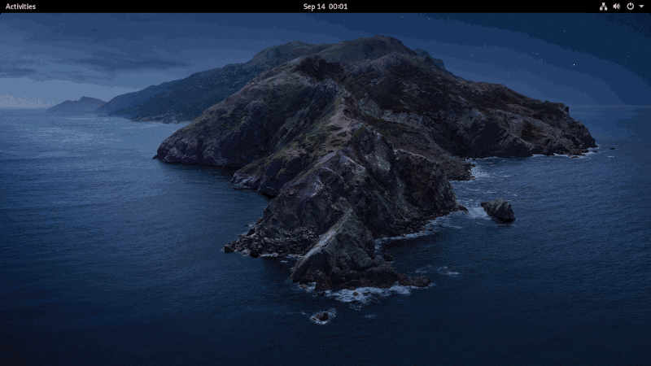

## Catalina Dynamic Wallpaper

Simple, time-based, macOS style dynamic wallpaper that transitions between the dark and light versions of macOS Catalina's default wallpapers.

### Screenshot



### Installation

- Clone the repo.

  ```bash
  git clone https://github.com/caglarturali/catalina-dynamic-wallpaper.git
  cd catalina-dynamic-wallpaper
  ```

- Install.
TODO: Add new installation instructions

### Usage

Choose Catalina Wallpapers from GNOME settings

### Credits :blush:

- [macOS Catalina](https://www.apple.com/macos/catalina-preview/)
- [@RaitaroH](https://gitlab.com/RaitaroH) from GitLab. This project is heavily inspired by his [dynamic-wall](https://gitlab.com/RaitaroH/dynamic-wall) and [KDE-Terminal-Wallpaper-Changer](https://gitlab.com/RaitaroH/KDE-Terminal-Wallpaper-Changer) repos.
